# TimeSlot

API REST + Frontend para gestión de reservas de horarios.

## 🚀 Demo

**Live:** [https://timeslot-4ge3.onrender.com/](https://timeslot-4ge3.onrender.com/)

### Screenshots

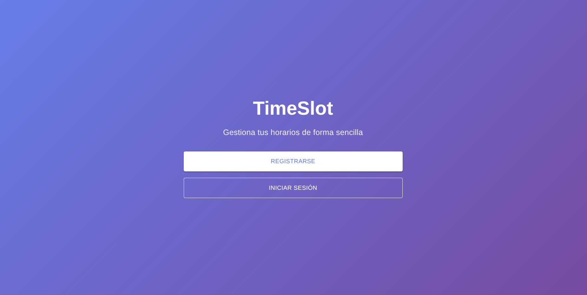
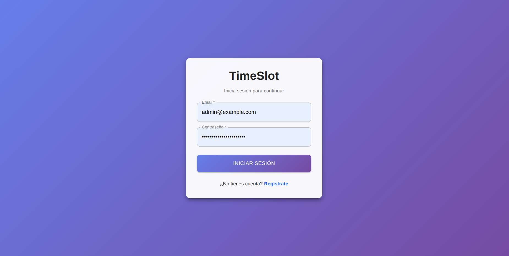
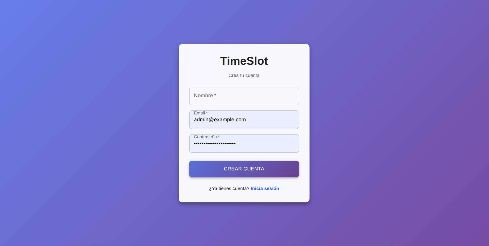
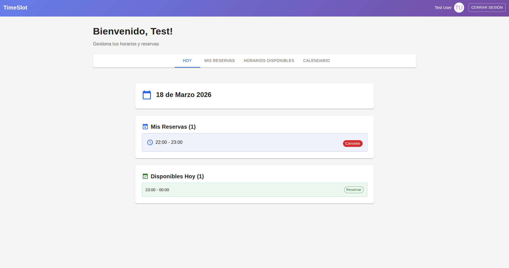
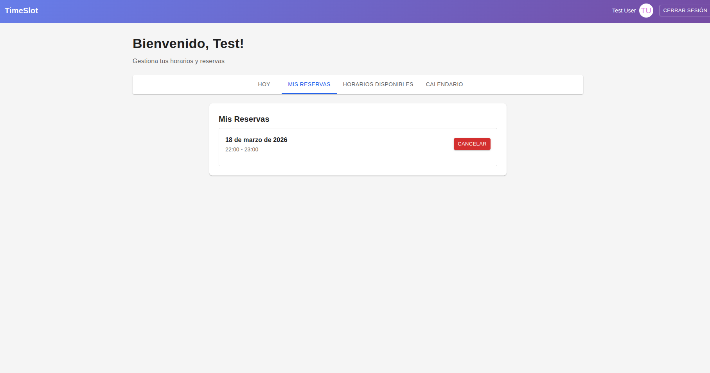
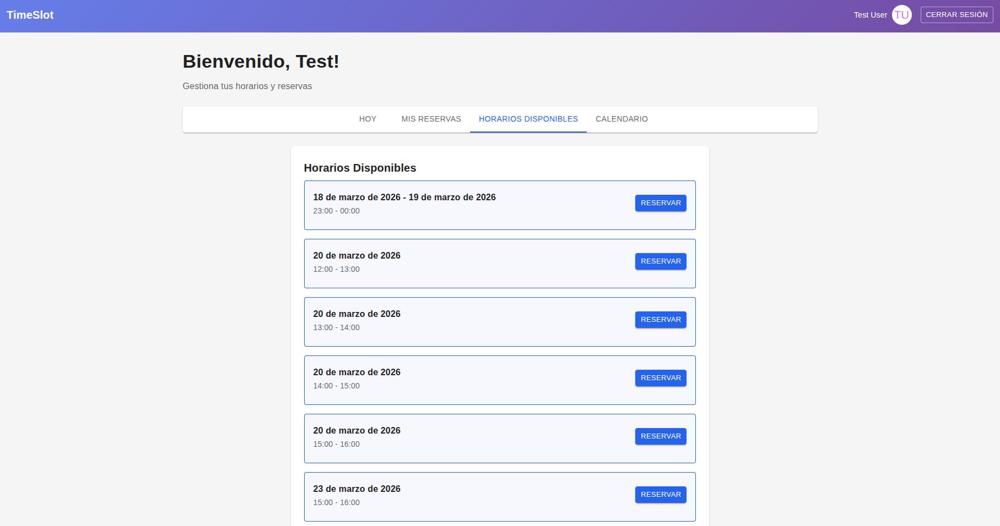
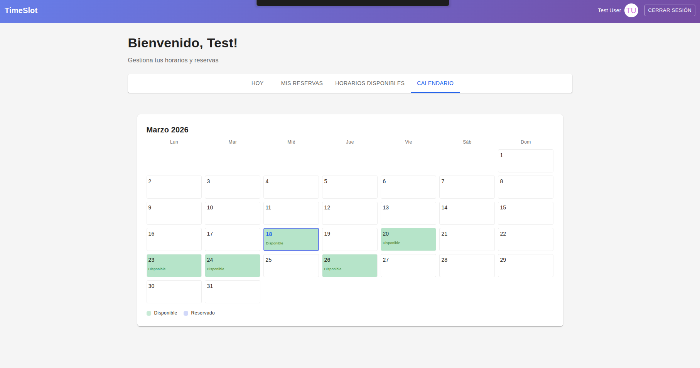
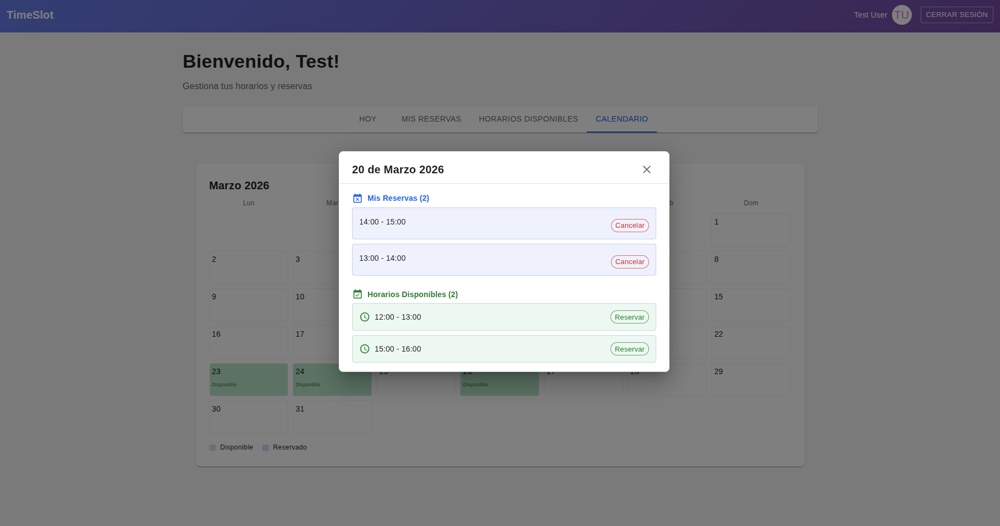
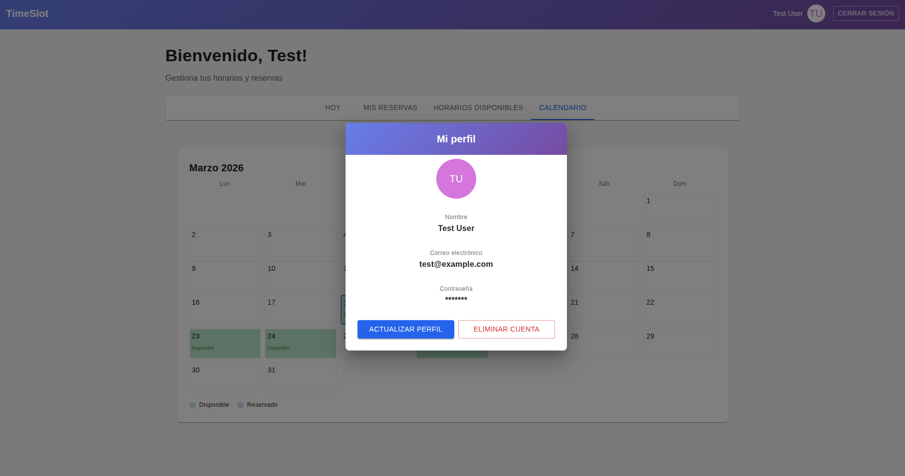
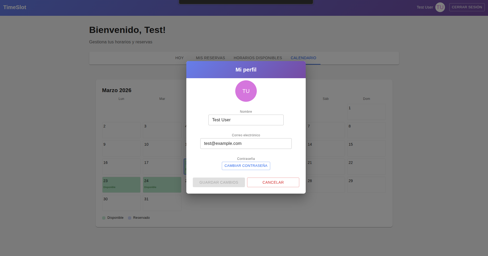
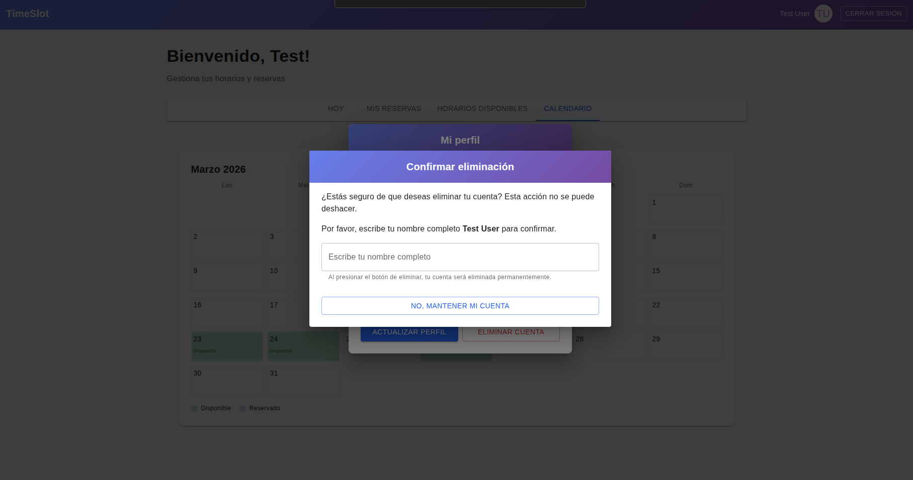
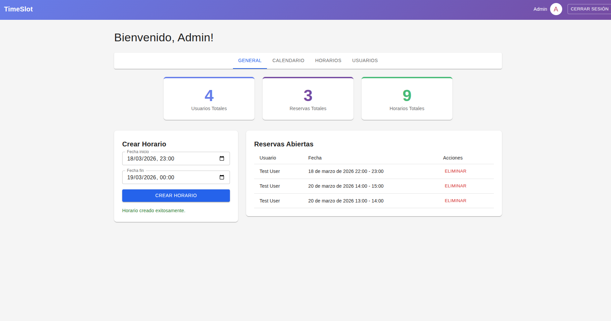
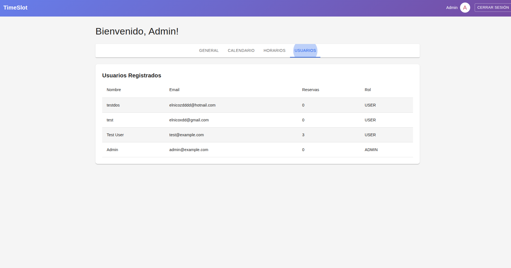

### Cuentas de prueba

- **Admin:**
  - Email: `admin@example.com`
  - Contraseña: `admin-32025f53135899ad`

- **Usuario:**
  - Email: `test@example.com`
  - Contraseña: `test1234`

---

## Stack

### Backend

- **Runtime:** Node.js
- **Framework:** Express 5
- **DB:** PostgreSQL + Prisma 7
- **Auth:** JWT + bcrypt
- **Validación:** Zod

### Frontend

- **Framework:** React 18 + Vite
- **UI:** MUI
- **Router:** React Router v6
- **State:** Context + Custom Hooks

## Estructura

```
TimeSlot/
├── backend/           # API REST
│   ├── src/
│   │   ├── controllers/
│   │   ├── services/
│   │   ├── routes/
│   │   ├── schemas/
│   │   ├── middlewares/
│   │   └── __tests__/
│   └── prisma/
├── frontend/         # App React
│   └── src/
│       ├── components/
│       ├── pages/
│       ├── services/
│       ├── hooks/
│       └── context/
└── docker-compose.test.yml
```

## Inicio rápido

```bash
make prepare # Instala dependencias y configura DB
make dev     # Inicia backend y frontend en modo desarrollo
```

## Modo desarrollo

- **Backend:** http://localhost:4000
- **Frontend:** http://localhost:5173

Ejecuta `make dev` o `npm run dev` para iniciar ambos servicios.

## Modo producción

```bash
make build   # Construye backend y frontend (o npm run build)
make start   # Inicia backend y frontend en modo producción (o npm run start)
```

## Tests

```bash
# Unit tests
npm test

# E2E tests (con Docker)
npm run docker:test:up   # Iniciar DB test
npm run test:e2e
npm run docker:test:down # Detener DB test
```

## Ver también

- [README Backend](./backend/README.md)
- [README Frontend](./frontend/README.md)
